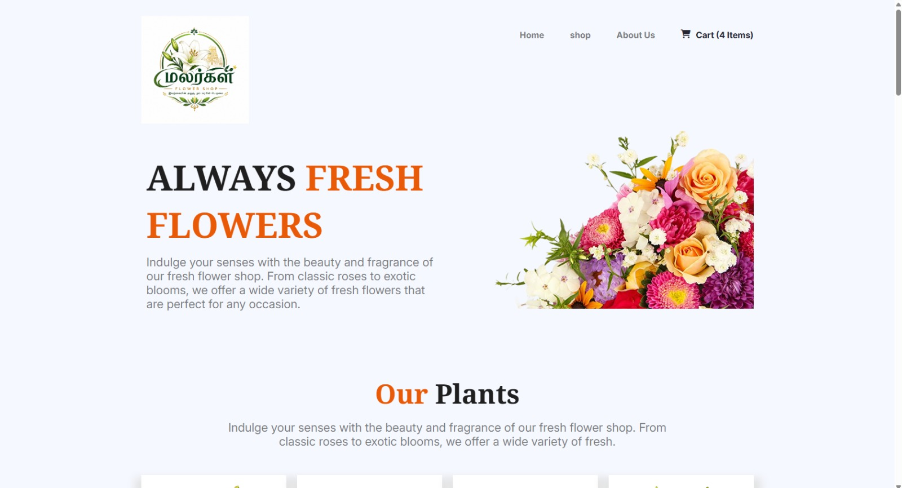
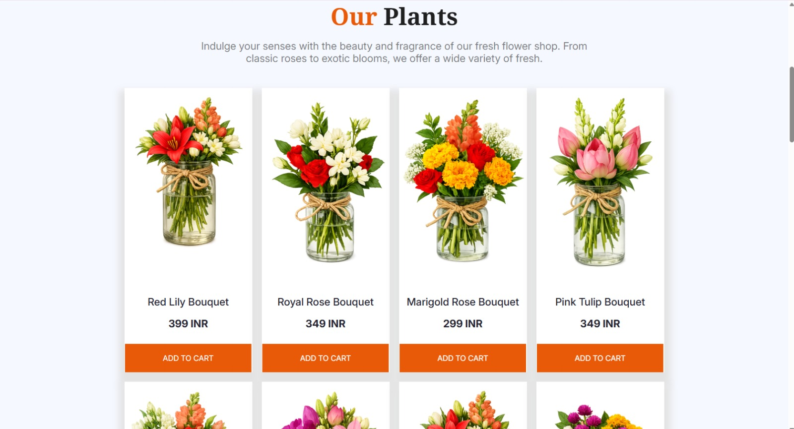

# 🌸 Flower Market - Indian Flowers & Plants Store

A modern and responsive flower marketplace website built using HTML5 and CSS3. This project showcases a beautiful collection of Indian flowers, bouquets, flowering plants, special offers, and a clean user-friendly design.

---

## 📖 About The Project

Flower Market is a front-end web project designed for flower shops, nurseries, and plant businesses. The website highlights a variety of Indian flowers including roses, jasmine, lotus, marigold, lilies, hibiscus, and ornamental plants.

The design focuses on simplicity, responsiveness, and an engaging user experience across desktop and mobile devices.

---

## ✨ Features

* Responsive Design
* Modern Navigation Bar
* Hero Banner Section
* Flower & Plant Product Showcase
* Product Cards with Hover Effects
* Indian Flower Collection
* Special Deals Section
* Newsletter Subscription Form
* Footer with Quick Links
* Mobile Friendly Layout
* CSS Grid & Flexbox Design

---

## 🖼️ Screenshots

### Homepage



### Products Section


---

## 🌺 Featured Flowers

* Royal Rose Bouquet
* Marigold Rose Bouquet
* Pink Tulip Bouquet
* Orange Hibiscus Bouquet
* Pink Lily & Orchid Bouquet
* Red Lily Bouquet
* Marigold Bouquet
* Jasmine Collection
* Lotus Collection

---

## 🛠️ Technologies Used

### Frontend

* HTML5
* CSS3
* CSS Grid
* Flexbox
* Font Awesome

### Design

* Responsive Layout
* Hover Animations
* Custom Typography
* Modern UI Components

---

## 📂 Project Structure

```text
flower-market/
│
├── index.html
│
├── css/
│   └── style.css
│
├── images/
│   ├── logo.png
│   ├── hero-flower.png
│   ├── sample-flower-image_1.png
│   ├── sample-flower-image_2.png
│   ├── sample-flower-image_3.png
│   ├── sample-flower-image_4.png
│   ├── sample-flower-image_5.png
│   ├── sample-flower-image_6.png
│   ├── sample-flower-image_7.png
│   ├── store_image.png
│   ├── roses.png
│   ├── lotus_pond.png
│   ├── plants.png
│   └── background_image.png
│
├── screenshots/
│   ├── homepage.png
│   ├── products-section.png
│   ├── flower-lover.png
│   ├── deals-section.png
│   └── mobile-view.png
│
└── README.md
```

---

## 🚀 Getting Started

### Clone Repository

```bash
git clone https://github.com/your-username/flower-market.git
```

### Open Project

```bash
cd flower-market
```

### Run

Simply open:

```text
index.html
```

in your browser.

---

## 📱 Responsive Design

The website is fully responsive and optimized for:

* Desktop
* Laptop
* Tablet
* Mobile Devices

---

## 🎯 Future Improvements

* Shopping Cart Functionality
* Product Search
* User Authentication
* Online Payment Integration
* Product Filtering
* Wishlist System
* Backend Integration
* Admin Dashboard

---

## 🌿 Inspiration

This project is inspired by traditional Indian flower markets and modern online flower stores, combining vibrant floral aesthetics with a clean web experience.

---

## 👨‍💻 Author

Hari

Frontend Developer

---

## ⭐ Support

If you like this project, consider giving it a ⭐ on GitHub.

---

## 📜 License

This project is created for educational and portfolio purposes.
